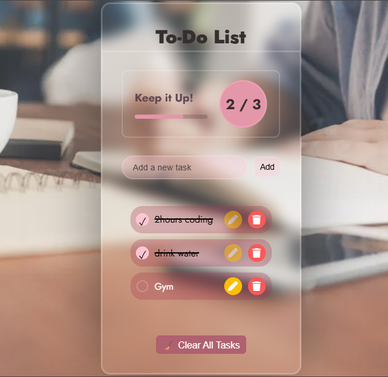

# 🗒️ To-Do List App

A simple, responsive To-Do List web application built using HTML, CSS, and JavaScript. 
It allows users to add, mark, and delete tasks — helping them stay organized and productive.

---

## 📸 Screenshot

---

## 🚀 Features

- ➕ Add new tasks
- 📝 Edit existing tasks
- ✅ Mark tasks as complete
- 🗑️ Delete individual tasks
- 🧹 Clear all tasks with one click
- 💾 Saves tasks in **Local Storage**
- 📱 Responsive design for all screen sizes
- 😴 Shows a calming image when no tasks are left

---

## 🛠️ Tech Stack

- HTML5
- CSS3 (Flexbox)
- JavaScript (ES6)
- LocalStorage

---

## 🌐 Live Demo
[View Live](https://tannuu29.github.io/to-do-app/)
